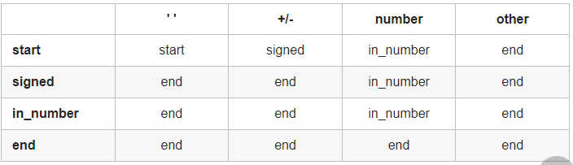

#### leetcode-1

##### JAVA

创建hashmap  

`Map<Integer,Integer> mp = new HashMap<Integer,Integer>();`

判断数字是否包含

`mp.containsKey(1);`

获取mp中值得位置，value找key

`mp.get(key);` 返回对应值对应到mp['key']=value中的找value。

`mp.put(key,value)	` 插入key-value的值。

##### Python

enumerate() 函数用于将一个可遍历的数据对象(如列表、元组或字符串)组合为一个索引序列，同时列出数据和数据下标，一般用在 for 循环当中。

Python 2.3. 以上版本可用，2.6 添加 start 参数。

以下展示了使用 enumerate() 方法的实例：

`\>>> seasons = ['Spring', 'Summer', 'Fall', 'Winter']`
`\>>> list(enumerate(seasons))`
`[(0, 'Spring'), (1, 'Summer'), (2, 'Fall'), (3, 'Winter')]`
`\>>> list(enumerate(seasons, start=1))    # 下标从 1 开始`
`[(1, 'Spring'), (2, 'Summer'), (3, 'Fall'), (4, 'Winter')]`

#### leetcode-2

链表，两数相加。

需要注意两链表长度不等的情况。

```java
     carry = sum / 10;
        if (l1 != null) {
            l1 = l1.next;
        }
        if (l2 != null) {
            l2 = l2.next;
        }
    }
    if (carry > 0) {
        tail.next = new ListNode(carry);
    }
    return head;
```

#### leetcode-3 最长重复子串

滑动窗口求解，需要注意有left 和right 两个地方，right默认是重复数组+1，left默认为？？更新左边的值。


后取大值。


#### leetcode-5 回文字符串

```JAVA
        char[] charArray = s.toCharArray();
        // 递推开始
        // 先枚举子串长度
        for (int L = 2; L <= len; L++) {
            // 枚举左边界，左边界的上限设置可以宽松一些
            for (int i = 0; i < len; i++) {
                // 由 L 和 i 可以确定右边界，即 j - i + 1 = L 得
                int j = L + i - 1;
                // 如果右边界越界，就可以退出当前循环
                if (j >= len) {
                    break;
                }

```

#### leetcode-7

JAVA 的整数最大最小值

```JAVA
 if (rev < Integer.MIN_VALUE / 10 || rev > Integer.MAX_VALUE / 10) 
```
C++的最大最小值

```C++
if (rev < INT_MIN / 10 || rev > INT_MAX / 10) {
```
Python的最大最小值
```
 if rev < INT_MIN // 10 + 1 or rev > INT_MAX // 10:
```

#### leetcode-8 ATOI-非算法题

##### 状态机下的字符串

方法一：自动机
思路

字符串处理的题目往往涉及复杂的流程以及条件情况，如果直接上手写程序，一不小心就会写出极其臃肿的代码。

因此，为了有条理地分析每个输入字符的处理方法，我们可以使用自动机这个概念：

我们的程序在每个时刻有一个状态 s，每次从序列中输入一个字符 c，并根据字符 c 转移到下一个状态 s'。这样，我们只需要建立一个覆盖所有情况的从 s 与 c 映射到 s' 的表格即可解决题目中的问题。

算法

本题可以建立如下图所示的自动机：


我们也可以用下面的表格来表示这个自动机：


接下来编程部分就非常简单了：我们只需要把上面这个状态转换表抄进代码即可。

另外自动机也需要记录当前已经输入的数字，只要在 s' 为 in_number 时，更新我们输入的数字，即可最终得到输入的数字。

作者：LeetCode-Solution
链接：https://leetcode-cn.com/problems/string-to-integer-atoi/solution/zi-fu-chuan-zhuan-huan-zheng-shu-atoi-by-leetcode-/
来源：力扣（LeetCode）
著作权归作者所有。商业转载请联系作者获得授权，非商业转载请注明出处。

#### leetcode-9 回文数

1.负号就直接false

2.可以读取一半，然后和另一边的比较。

3.用/,*,%的数学方式读取最后一个数字的值，再和第二行的判断。

#### leetcode-10 正则匹配-模拟-困难

没看懂

#### leetcode-11 动态规划-双指针

在每个状态下，无论长板或短板向中间收窄一格，都会导致水槽 底边宽度 -1−1 变短：

若向内 移动短板 ，水槽的短板 min(h[i], h[j])min(h[i],h[j]) 可能变大，因此下个水槽的面积 可能增大 。
若向内 移动长板 ，水槽的短板 min(h[i], h[j])min(h[i],h[j]) 不变或变小，因此下个水槽的面积 一定变小 。
因此，初始化双指针分列水槽左右两端，循环每轮将短板向内移动一格，并更新面积最大值，直到两指针相遇时跳出；即可获得最大面积。

作者：jyd
链接：https://leetcode-cn.com/problems/container-with-most-water/solution/container-with-most-water-shuang-zhi-zhen-fa-yi-do/
来源：力扣（LeetCode）
著作权归作者所有。商业转载请联系作者获得授权，非商业转载请注明出处。

#### leetcode-12 转罗马数字

通过C语言和电子行业的硬编码的方式直接硬编码到String列表中。

#### leetcode-13 罗马数字

使用Switch代替Hashmap,并且将12里面官方解法的50/40硬编码，计算sum，速度最快。

#### 15.a+b+c之和为0

也就是说，我们枚举的三元组 (a, b, c)(a,b,c) 满足 a \leq b \leq ca≤b≤c，保证了只有 (a, b, c)(a,b,c) 这个顺序会被枚举到，而 (b, a, c)(b,a,c)、(c, b, a)(c,b,a) 等等这些不会，这样就减少了重复。要实现这一点，我们可以将数组中的元素从小到大进行排序，随后使用普通的三重循环就可以满足上面的要求。

作者：LeetCode-Solution
链接：https://leetcode-cn.com/problems/3sum/solution/san-shu-zhi-he-by-leetcode-solution/
来源：力扣（LeetCode）
著作权归作者所有。商业转载请联系作者获得授权，非商业转载请注明出处。

#### 17.回溯
这题的这个思路很好，说明了递归加回溯的做法。

//最终输出结果的list
	
	List<String> res = new ArrayList<>();
	//递归函数
	void iterStr(String str, StringBuilder letter, int index) {
		//递归的终止条件，注意这里的终止条件看上去跟动态演示图有些不同，主要是做了点优化
		//动态图中是每次截取字符串的一部分，"234"，变成"23"，再变成"3"，最后变成""，这样性能不佳
		//而用index记录每次遍历到字符串的位置，这样性能更好
		if(index == str.length()) {
			res.add(letter.toString());
			return;
		}
		//获取index位置的字符，假设输入的字符是"234"
		//第一次递归时index为0所以c=2，第二次index为1所以c=3，第三次c=4
		//subString每次都会生成新的字符串，而index则是取当前的一个字符，所以效率更高一点
		char c = str.charAt(index);
		//map_string的下表是从0开始一直到9， c-'0'就可以取到相对的数组下标位置
		//比如c=2时候，2-'0'，获取下标为2,letter_map[2]就是"abc"
		int pos = c - '0';
		String map_string = letter_map[pos];
		//遍历字符串，比如第一次得到的是2，页就是遍历"abc"
		for(int i=0;i<map_string.length();i++) {
			//调用下一层递归，用文字很难描述，请配合动态图理解
	        letter.append(map_string.charAt(i));
	        //如果是String类型做拼接效率会比较低
			//iterStr(str, letter+map_string.charAt(i), index+1);
	        iterStr(str, letter, index+1);
	        letter.deleteCharAt(letter.length()-1);
		}
	}
}

作者：wang_ni_ma
链接：https://leetcode-cn.com/problems/letter-combinations-of-a-phone-number/solution/tong-su-yi-dong-dong-hua-yan-shi-17-dian-hua-hao-m/
来源：力扣（LeetCode）
著作权归作者所有。商业转载请联系作者获得授权，非商业转载请注明出处。

#### 21.合并有序链表

 // 合并后 l1 和 l2 最多只有一个还未被合并完，我们直接将链表末尾指向未合并完的链表即可
        `prev.next = l1 == null ? l2 : l1;`

后续没有合并的链表内容。

#### 32 最长有效括号

扫两遍，正向扫和反向扫，判断left 的左括号和right的右括号数量。

#### 33 部分有序

面对分部分有序的，都是用二分算法。

#### 44 hard题

不会，。。。

#### 45 

贪心算法或者动态规划。

#### 49字符串异位分组

需要将字符串分成每个字符后排序处理。

#### 58 最后一个单词的长度

用反向遍历，设index为 length-1.


#### 59 旋转矩阵

通过         int\[][] directions = {{0, 1}, {1, 0}, {0, -1}, {-1, 0}}; // 右下左上 

判定下一步前进方向

通过

```java
//通过nextRow判断下一步的row 的位置
int nextRow = row + directions[directionIndex][0], 
// 通过nextColumn判断下一步column位置

nextColumn = column + directions[directionIndex][1];
            if (nextRow < 0 || nextRow >= n || nextColumn < 0 || nextColumn >= n || matrix[nextRow][nextColumn] != 0) {
                directionIndex = (directionIndex + 1) % 4; // 顺时针旋转至下一个方向
            }
            row = row + directions[directionIndex][0];
            column = column + directions[directionIndex][1];

```

#### 63 障碍物路径

```Bash
if (obstacleGrid[i][j] == 1) {
                    f[j] = 0;
                    continue;
                }
// 设置障碍物的路径，将f[j]设置为零

 f[0] = (obstacleGrid[0][0] == 0);
        for (int i = 0; i < n; ++i) {
            for (int j = 0; j < m; ++j) {
                if (obstacleGrid[i][j] == 1) {
                    f[j] = 0;
                    continue;
                }
                if (j - 1 >= 0 && obstacleGrid[i][j - 1] == 0) {
                    f[j] += f[j - 1];
                }
            }
        }

        return f.back();
    }
};
--------------------------
for (int i = 1; i < m; i++) {
            for (int j = 1; j < n; j++) {
                if (obstacleGrid[i][j] == 0) {
                    dp[i][j] = dp[i - 1][j] + dp[i][j - 1];
                }
            }
        }

作者：sweetiee
链接：https://leetcode-cn.com/problems/unique-paths-ii/solution/jian-dan-dpbi-xu-miao-dong-by-sweetiee/
来源：力扣（LeetCode）
著作权归作者所有。商业转载请联系作者获得授权，非商业转载请注明出处。
```

##### 65 字符串问题

通过有限状态机，或者状态机，等方式实现。

##### 66 注意返回的类型

```java
 public int[] plusOne(int[] digits) {
```

返回的是 int[] , 所以每个for 循环返回一个值，然后合起来作为返回值，第二个return 作为，，，我就是不理解了。。。还是要调试看怎么运行的。。。


##### 67 十进制二进制转换

>  def addBinary(self, a, b) -> str:
>         return '{0:b}'.format(int(a, 2) + int(b, 2))
>
> 

> class Solution {
>     public String addBinary(String a, String b) {
>         return Integer.toBinaryString(
>             Integer.parseInt(a, 2) + Integer.parseInt(b, 2)
>         );
>     }
> }
>
> 


##### 71 注意队列

​        Deque<String> stack = new ArrayDeque<String>(); 

​                    stack.pollLast(); 

​                ans.append(stack.pollFirst()); 


##### 75 荷兰国旗问题

