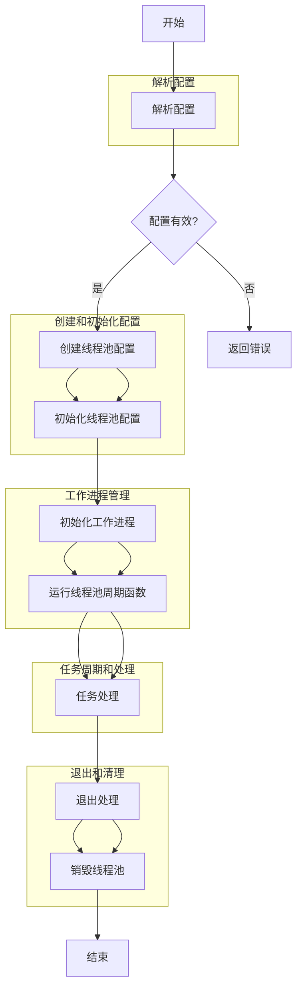

### 介绍线程创建

以下是 `ngx_thread_pool` 模块的工作流程图，展示了从配置解析到线程池的初始化、任务处理和退出的完整过程：

### 详细步骤说明：
1. **解析配置** (`ngx_thread_pool`): 解析 Nginx 配置文件中关于线程池的配置。
2. **创建线程池配置** (`ngx_thread_pool_create_conf`): 为每个线程池创建配置结构。
3. **初始化线程池配置** (`ngx_thread_pool_init_conf`): 根据配置初始化线程池的参数。
4. **初始化工作进程** (`ngx_thread_pool_init_worker`): 在 Nginx 工作进程启动时初始化线程池。
5. **运行线程池周期函数** (`ngx_thread_pool_cycle`): 线程池中的线程执行的主循环，处理任务。
6. **任务处理** (`ngx_thread_task_post` 和 `ngx_thread_pool_handler`): 提交和处理线程池任务。
7. **退出处理** (`ngx_thread_pool_exit_worker`): 在工作进程退出时处理线程池的退出。
8. **销毁线程池** (`ngx_thread_pool_destroy`): 清理和销毁线程池资源。

这个流程图提供了从配置到执行再到退出的全面视图，涵盖了线程池模块的主要功能和生命周期管理。

