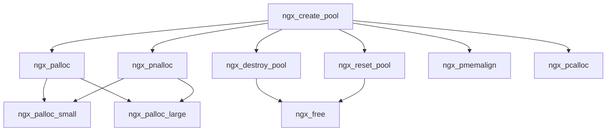

### 源码分析：`ngx_palloc.c`

#### 1. 起始函数功能和说明
`ngx_palloc.c` 文件主要负责内存池的管理，包括内存的分配、释放和重置。内存池的设计目的是为了减少频繁的内存分配和释放操作，从而提高内存使用效率和性能。

- **`ngx_create_pool(size_t size, ngx_log_t *log)`**:
  - 功能：创建一个新的内存池。
  - 参数：
    - `size`：内存池的初始大小。
    - `log`：用于记录日志的对象。
  - 返回值：新创建的内存池对象。

#### 2. 源码的功能函数流向
- **内存分配**:
  - `ngx_palloc(ngx_pool_t *pool, size_t size)` 和 `ngx_pnalloc(ngx_pool_t *pool, size_t size)`：根据请求的大小，决定是调用 `ngx_palloc_small` 还是 `ngx_palloc_large`。
  - `ngx_palloc_small(ngx_pool_t *pool, size_t size, ngx_uint_t align)`：在当前内存池中分配小块内存。
  - `ngx_palloc_large(ngx_pool_t *pool, size_t size)`：在内存池中分配大块内存，通常是通过单独的内存块来管理。

- **内存释放**:
  - `ngx_destroy_pool(ngx_pool_t *pool)`：销毁内存池，释放所有关联的资源。
  - `ngx_reset_pool(ngx_pool_t *pool)`：重置内存池，保留内存池结构但释放分配的内存块。

- **特殊内存操作**:
  - `ngx_pmemalign(ngx_pool_t *pool, size_t size, size_t alignment)`：按照指定的对齐方式分配内存。
  - `ngx_pcalloc(ngx_pool_t *pool, size_t size)`：分配内存并初始化为零。

#### 3. Mermaid 图示表示

![[export.png]]
#### 4. 重点函数和优化建议
- **重点函数**:
  - `ngx_palloc_small` 和 `ngx_palloc_large` 是内存分配的核心，处理小块和大块内存的分配逻辑。
  - `ngx_destroy_pool` 和 `ngx_reset_pool` 是内存释放和重置的关键，确保内存池的有效管理。

- **优化建议**:
  - **内存对齐**：确保内存分配对齐可以提高内存访问速度。
  - **错误处理**：增强错误处理逻辑，确保所有内存分配失败都能被妥善处理。
  - **日志记录**：优化日志记录，对关键操作进行详细记录，便于问题追踪和性能调优。