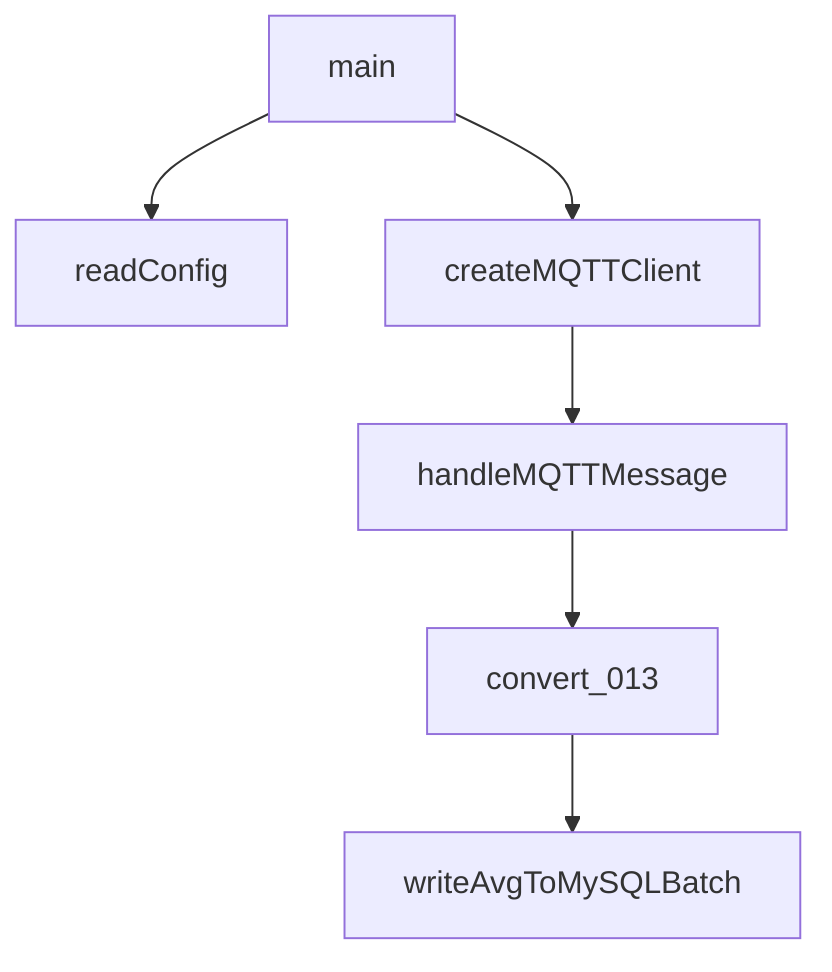

  源码阅读的提示词工程。


### 源码分析注意事项

```
源码阅读并且给出源码分析的时候我们需要注意什么： 1. 源码中起始函数的功能和说明，以及起始函数的功能边界。 2. 源码的功能函数流向，具体的函数功能。 3. 能够以PlumUML的图示形式表示出来。 4. 源码中的重点函数，关键函数等。给出优化后的提示词工程。

一个文件一个文件的方式进行分析，一个merge request和 issues 中有可能分析的问题的地方进行分析。

```


```
绘制整个函数的工作流程，不限于单个文件，给出完整的PlumtUML图示。
```


在进行源码阅读和分析时，以下几点是关键：

1. **起始函数的功能和边界**：
   - 确定程序的入口点，通常是 [main](file:///d%3A/PythonProj/QtProj/Sensor-go/doc/datamatch12%E9%9D%99%E6%80%81%E5%BA%94%E5%8F%98%E8%AE%A1%E7%9A%84%E5%8A%9F%E8%83%BD%E4%BB%8B%E7%BB%8D.md#17%2C12-17%2C12) 函数或类似的初始化函数。
   - 明确函数的职责范围和它所依赖的外部资源。

2. **功能函数流向**：
   - 理解各个函数之间的调用关系和数据流向。
   - 分析函数的输入输出，以及它们如何影响程序的状态。

3. **Mermaid 图示表示**：
   - 使用 [Mermaid](https://mermaid-js.github.io/mermaid/#/) 来可视化函数调用流程和组件关系。

4. **重点和关键函数**：
   - 识别核心逻辑所在的函数，这些函数对程序的功能实现至关重要。
   - 提出可能的优化建议，如性能提升、代码简化等。

### 示例分析：[srcsql/Match013udp.go](file:///d%3A/PythonProj/QtProj/Sensor-go/srcsql/Match013udp.go#1%2C1-1%2C1)

#### 起始函数：[main](file:///d%3A/PythonProj/QtProj/Sensor-go/doc/datamatch12%E9%9D%99%E6%80%81%E5%BA%94%E5%8F%98%E8%AE%A1%E7%9A%84%E5%8A%9F%E8%83%BD%E4%BB%8B%E7%BB%8D.md#17%2C12-17%2C12)
- 功能：配置读取，MQTT客户端设置，无限循环以保持程序运行。
- 边界：处理MQTT连接和消息订阅，不直接处理数据转换和数据库写入。

#### 功能函数流向
- [main](file:///d%3A/PythonProj/QtProj/Sensor-go/doc/datamatch12%E9%9D%99%E6%80%81%E5%BA%94%E5%8F%98%E8%AE%A1%E7%9A%84%E5%8A%9F%E8%83%BD%E4%BB%8B%E7%BB%8D.md#17%2C12-17%2C12) 调用 [handleMQTTMessage](file:///d%3A/PythonProj/QtProj/Sensor-go/doc/dataMatch001%E5%8D%95%E7%82%B9%E6%B2%89%E9%99%8D%E8%AE%A1%E7%9A%84%E5%8A%9F%E8%83%BD%E4%BB%8B%E7%BB%8D%E5%92%8C%E8%AF%B4%E6%98%8E.md#54%2C28-54%2C28) 来处理接收到的MQTT消息。
- [handleMQTTMessage](file:///d%3A/PythonProj/QtProj/Sensor-go/doc/dataMatch001%E5%8D%95%E7%82%B9%E6%B2%89%E9%99%8D%E8%AE%A1%E7%9A%84%E5%8A%9F%E8%83%BD%E4%BB%8B%E7%BB%8D%E5%92%8C%E8%AF%B4%E6%98%8E.md#54%2C28-54%2C28) 解析消息，调用 [convert_013](file:///d%3A/PythonProj/QtProj/Sensor-go/doc/dataMatch013%E5%8A%A8%E6%80%81%E5%BA%94%E5%8F%98%E8%AE%A1%E7%9A%84%E5%8A%9F%E8%83%BD%E4%BB%8B%E7%BB%8D.md#78%2C17-78%2C17) 转换数据，然后批量写入数据库。

#### Mermaid 图示


#### 重点函数：`handleMQTTMessage`
- 关键功能：消息解析，数据转换，批量数据处理。
- 优化建议：增加错误处理机制，优化数据处理逻辑以减少延迟。

通过上述步骤，我们可以系统地分析和理解源码的结构和功能，为进一步的维护和优化打下基础。